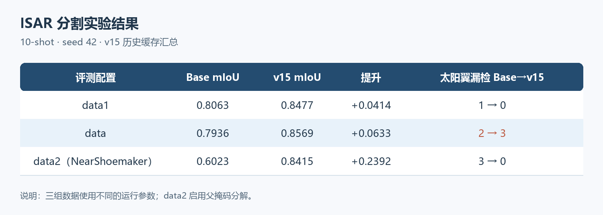
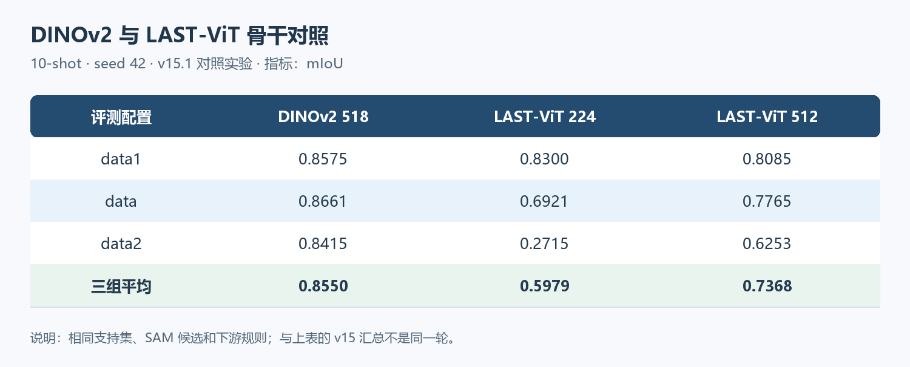
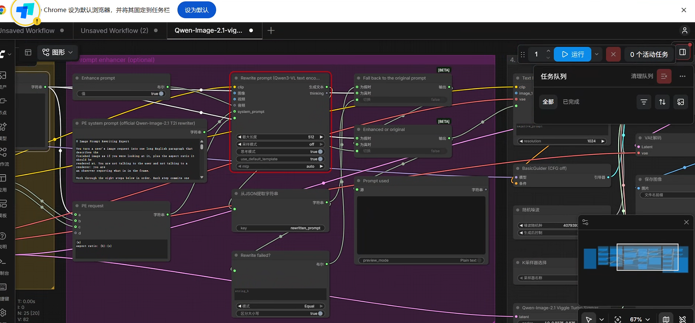

# 周报

近期继续做 ISAR 空间目标的舱体与太阳翼分割，主要评估 TG、Aura 和多帆板 NearShoemaker 数据。现有方法用 SAM2-AMG 生成候选掩码，再用 DINOv2 的少样本原型判断类别，并融合重叠候选。另在 3090 Ti 上部署了 Qwen 文生图模型。

## 分割实验结果

下表是已有的 **10-shot、seed 42** 缓存结果。v15 在三组评测配置上的 mIoU 均高于 Base，其中 `data2`（NearShoemaker）提升最明显。

### 结果分析

NearShoemaker 中，多块太阳翼有时被并入整目标掩码。v14/v15 用“父掩码减舱体”和 DINO 特征在残余区域恢复太阳翼，因此改善较大。三组数据共用主流程，但 `data2` 启用了专门的父掩码分解，并关闭 v15 的 Base 候选回退。`data` 虽然 mIoU 提高，太阳翼漏检却从 2 增到 3，仍需处理。

目前的思路是继续用散射强度结构和支持集校准补充 DINO 语义判断，对细薄或不确定的太阳翼做局部细化。**v15.1/LAST-ViT 的 1/3/5/10-shot 全矩阵及 ISAR-STHD 的全量结果尚未完成；上表不代表它们的最终成绩。**

## LAST 与 DINO 对照尝试

此前已在服务器上把 LAST-ViT 的 DINO 权重作为特征骨干接入，和原 DINOv2 在**相同 10-shot、seed 42、支持集、SAM 候选及下游规则**下对照。下表是这次 **v15.1 骨干对照**的 mIoU，与上面的 v15 历史汇总不是同一轮结果。

把 LAST-ViT 输入从 224 提到 512 后，`data2` 的 mIoU 从 0.2715 回升到 0.6253，说明较粗的 `14×14` 特征网格是退化原因之一；但 512 仍未超过 DINOv2。少量可视化中 LAST 的目标与背景响应更集中，舱体和太阳翼却没有稳定分开。当前评分阈值原本按 DINOv2 设定，因此这些结果说明 **LAST 不能直接无调参替换现有骨干**，不能据此断定 LAST 特征本身无用。

另外还制作并尝试启动了 **ISAR-LAST-DINOv2-B/14 继续训练**工程，计划用无标签 ISAR 图像训练新权重。已确认服务器 CUDA 可用、训练图像路径已设置；最近一次记录中训练进程已退出，**尚未看到成功导出的新权重或其下游分割指标**。这项尝试与上表的 LAST-ViT 直接换骨干实验不同。

## 文生图模型部署

3090 Ti 上已部署 Qwen-Image-2.1、Viggle Turbo 和 ComfyUI；聊天记录确认文生图成功。以下两张图分别是工作流和本机打开的 ComfyUI 页面，均不是生成图片。工作流截图中的 `Enhance prompt=true` 在当前驱动环境会触发兼容错误，运行时改为 `false`。

## 下一步

1. 完成 DINOv2 与 LAST-ViT 的 1/3/5/10-shot 对比，重点分析太阳翼漏检和 NearShoemaker 多帆板样本。
2. 排查 ISAR-LAST-DINOv2 训练中断原因；取得新权重后，再测试其分割效果。
3. 补齐 Qwen 文本推理与图片编辑测试，保存运行记录和实际生成图片。

